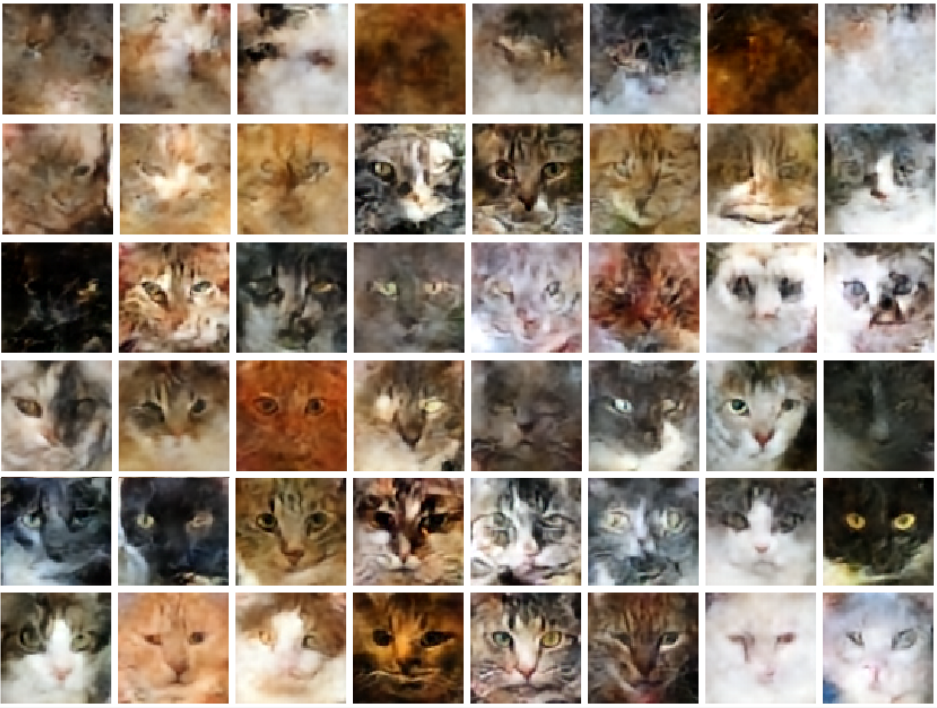
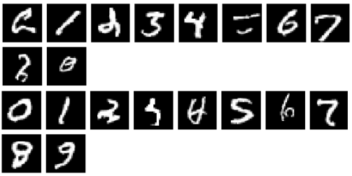

### VQVAE + PixelSNAIL prior

- Dataset: https://www.kaggle.com/datasets/spandan2/cats-faces-64x64-for-generative-models

Trained VQVAE for 20 epochs + pixelSNAIL prior for 50 epochs, which took ~30m on RTX3080 laptop GPU.
See config files for training details.

### Generating Cat Faces

from top: epoch 0 -> bottom: epoch 50

### Conditional Generation of MNIST using PixelSNAIL
given a number between 0~9, generates MNIST-like image of that digit. PixelSNAIL trains much faster with conditioning.

[Read more here (wandb)](https://wandb.ai/cvl2023/PixelCNN_VQVAE/reports/VQVAE-and-PixelSNAIL-Decoder--Vmlldzo2ODI4MDQ3)
